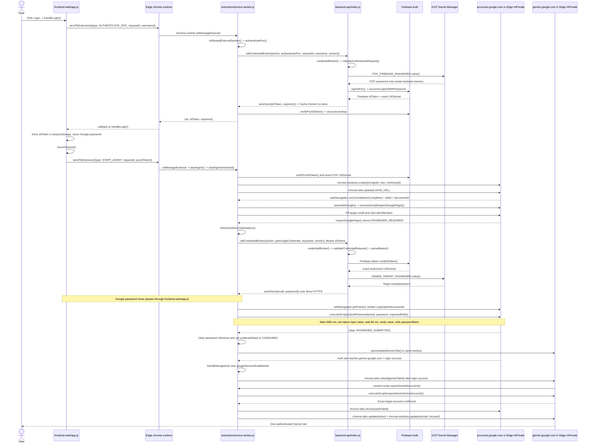

# POC SSO Gemini by Browser Extension

เว็บ Production: <https://poc-after-sso-login-gemini.web.app/>

## เครื่องผู้ใช้ต้องติดตั้งอะไร

**ติดตั้ง Extension และเปิด Allow in InPrivate/Incognito เท่านั้น แล้วใช้งานผ่านเว็บ Production ได้เลย**

ไม่ต้องติดตั้ง Node.js, PowerShell script, Native Messaging host, Windows Credential Manager หรือ reboot เครื่อง

ขั้นตอนบนเครื่องใหม่:

1. ดาวน์โหลด [Extension v0.13.5](https://poc-after-sso-login-gemini.web.app/downloads/gemini-extension-agent-poc-v0.13.5.zip) แล้วแตก ZIP
2. เปิด `edge://extensions` หรือ `chrome://extensions`
3. เปิด Developer mode และกด Load unpacked โดยเลือกโฟลเดอร์ `extension`
4. เปิด Allow in InPrivate/Incognito ในหน้า Details ของ Extension
5. เปิดเว็บ Production และกด Login

Extension ID ต้องแสดงเป็น `jeenmgigpkffleijbmfciffiodlcdafh` ถ้า ID ไม่ตรง Backend จะไม่ส่ง credential ให้

## Repository นี้มีอะไร

Runtime ที่ใช้งานจริงมีเพียงสามส่วนและอยู่ใน repository นี้ทั้งหมด:

| โฟลเดอร์ | คืออะไร | Entry point | Deploy/Run ที่ไหน |
| --- | --- | --- | --- |
| [`frontend-web/`](./frontend-web/) | หน้าเว็บหลัก | `index.html`, `app.js` | Firebase Hosting |
| [`backend-api/`](./backend-api/) | หลังบ้านและ Credential API | `index.js` ฟังก์ชัน `credentialBroker` | Firebase Functions v2 บน GCP |
| [`extension/`](./extension/) | Process หลักที่ควบคุม Edge/Chrome และ Google login | `service-worker.js` | Edge/Chrome ของผู้ใช้ |

ส่วนอื่น:

- `firebase.json` — กำหนด `frontend-web` เป็น Hosting และ `backend-api` เป็น Functions
- `scripts/` — build/package/verify สำหรับเครื่องพัฒนา
- `tests/` และ `backend-api/test/` — automated tests
- `docs/legacy-reference-agent/` — โค้ดเก่าเพื่ออ้างอิง ไม่ถูก build หรือ deploy

```text
poc-sso-by-extenstion/
├── frontend-web/       ← หน้าเว็บ
├── backend-api/        ← หลังบ้าน GCP
├── extension/          ← Edge/Chrome Extension และ process หลัก
├── scripts/            ← build/verify
├── tests/              ← tests
└── firebase.json       ← deployment mapping
```

## End-to-end engineering diagram

Diagram นี้แสดงชื่อไฟล์ ฟังก์ชัน message และข้อมูลที่ส่งจริงตั้งแต่ผู้ใช้กด Login จน Edge แสดง Gemini ที่ login สำเร็จ



Password ไม่ผ่านหน้าเว็บ `frontend-web/app.js` เส้นทางของ password คือ:

```text
GCP Secret Manager
    → backend-api/index.js: credentialBroker()
    → HTTPS response ตรงไป Extension
    → extension/service-worker.js: fetchOneShotCredential()
    → submitPassword() ใน exact Google document
    → overwrite เป็นค่าว่างและปล่อย reference
```

### Payload ที่ Extension ขอ Google credential

```http
POST https://us-central1-poc-after-sso-login-gemini.cloudfunctions.net/credentialBroker
Origin: chrome-extension://jeenmgigpkffleijbmfciffiodlcdafh
Authorization: Bearer <Firebase-ID-token>
Content-Type: application/json

{
  "action": "getGoogleCredential",
  "requestId": "<UUID-v4>",
  "version": 10
}
```

Response ส่งตรงจาก `backend-api/index.js/credentialBroker()` ไป `extension/service-worker.js/callCredentialBroker()`:

```json
{
  "ok": true,
  "email": "<target-account>",
  "password": "<temporary-in-memory-value>"
}
```

## Process หลักเรียกฟังก์ชันอะไรบ้าง

1. `frontend-web/app.js/handleLogin()` รับการกด Login
2. `sendToExtension()` เรียก `chrome.runtime.sendMessage(EXTENSION_ID, ...)`
3. Edge ส่ง message เข้า `extension/service-worker.js/onMessageExternal`
4. `authenticatePoc()` เรียก `callCredentialBroker()` เพื่อขอ Firebase ID token
5. `launchGemini()` ส่ง `START_AGENT`; Extension รับด้วย `startAgent()` และ `startAgentUnlocked()`
6. `startAgentUnlocked()` ใช้ `chrome.windows.create({ incognito: true })` เปิด Edge InPrivate
7. `handleNavigation()` และ `automateGoogle()` ติดตาม exact `tabId` และ `documentId`
8. `inspectGooglePage()` กรอก email และยืนยันว่าถึง password page ของบัญชีเป้าหมาย
9. `fetchOneShotCredential()` POST `getGoogleCredential` ไป `backend-api/index.js/credentialBroker`
10. Backend ใช้ Firebase Admin `verifyIdToken()` แล้วอ่าน `GEMINI_TARGET_PASSWORD` จาก Secret Manager
11. `submitPassword()` กรอก password, ตรวจค่าก่อนคลิก Next และคืน `PASSWORD_SUBMITTED`
12. `openIsolatedGeminiTab()` เปิด Gemini; `reportGeminiDocument()` และ `inspectGeminiActiveAccount()` ยืนยันบัญชีก่อนแสดงหน้าต่าง

## Security boundary

- Password ไม่อยู่ใน Git, ZIP, Hosted page, Extension source, status หรือ `chrome.storage`
- Backend อนุญาตเฉพาะ exact Extension origin และตรวจ Firebase UID/email ก่อนตอบ credential
- Extension ขอ password หลังยืนยัน exact Google password document เท่านั้นและมีสถานะ one-shot
- ถ้า Google ขอ MFA, CAPTCHA, passkey หรือ device approval ระบบจะหยุดและไม่ bypass
- เนื่องจาก POC ส่ง reusable password ลง client ผู้ที่ควบคุมเครื่องหรือแก้ Extension สามารถ inspect password ใน memory ได้ การใช้งาน production ที่ห้าม endpoint เห็น password ต้องเปลี่ยนเป็น token/federated flow

## Build และ deploy

คำสั่งเหล่านี้ใช้เฉพาะเครื่องพัฒนา ไม่ต้องรันบนเครื่องผู้ใช้:

```powershell
npm install --prefix .\backend-api
npm test --prefix .\backend-api
powershell -ExecutionPolicy Bypass -File .\scripts\package-extension.ps1
powershell -ExecutionPolicy Bypass -File .\scripts\verify.ps1
npx --yes firebase-tools deploy --only functions,hosting --project poc-after-sso-login-gemini
```
